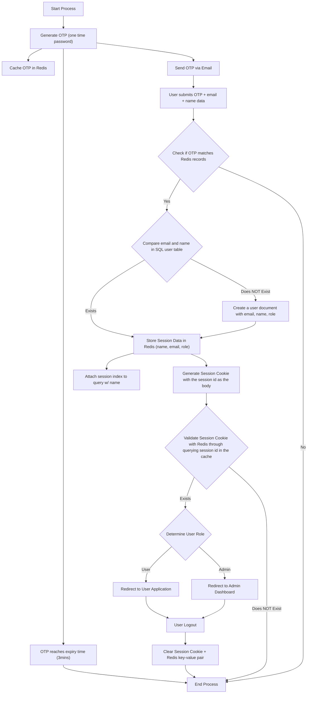

## 🔐 Authentication Flow

The authentication for StockSavvy is conducted through Redis-stored sessions. All of these sessions have an associated index for easier retrival when you need to query speific content from the body (name, email, etc). This index and advanced "full-text" querying is acheived through the **RediSearch module**.

### Here is an example of it on Redis-CLI:
- created JSON sessions
- created idx:session index that stores sessions names for retrvial
- retrieving each session built through referencing associated names with idx:session index
  

 
 
 
This same logic will be applied to the authflow in which all sessions are associated with an index which is configured through CLI-interface (same command as <b>FT.CREATE</b>) meaning all sessions will now have this index attached to it.
 

