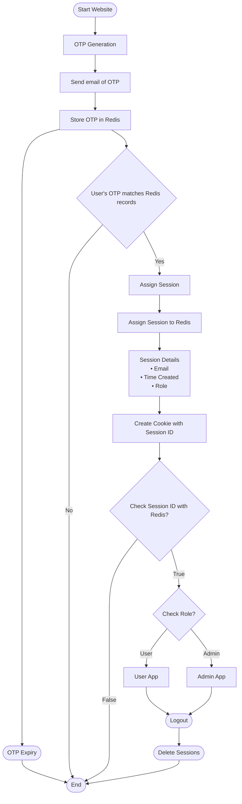

## 🔐 Authentication Flow

```mermaid 
flowchart 
    A([Start Website]) --> B[OTP Generation]
    B --> KJ[Send email of OTP]
    KJ --> C[Store OTP in Redis]
    C --> D([OTP Expiry])
    D --> O([End])
  
    C --> E{User's OTP matches Redis records}
    E -- Yes --> F[Assign Session]
    E -- No --> O
  
    F --> G[Assign Session to Redis]
    G --> H[Session Details<br/>• Email<br/>• Time Created<br/>• Role]
    H --> I[Create Cookie with Session ID]
    I --> J{Check Session ID with Redis?}
    J -- True --> K{Check Role?}
    J -- False --> O
  
    K -- User --> L[User App]
    K -- Admin --> M[Admin App]
    L --> N([Logout])
    M --> N
    N --> P([Delete Sessions])
    P --> O


```

