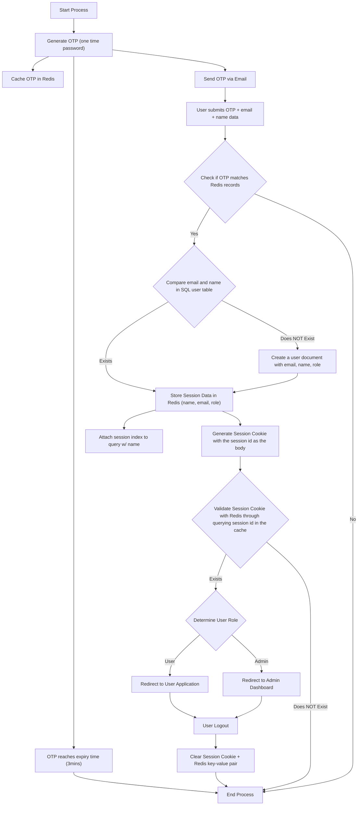

## 🔐 Authentication Flow

The authentication for StockSavvy is conducted through session based authentication. 

### Cookies Communication In-Depth:

The cookies are sent and stored within the frontend client and attached to each response sent by a speific backend client. 
