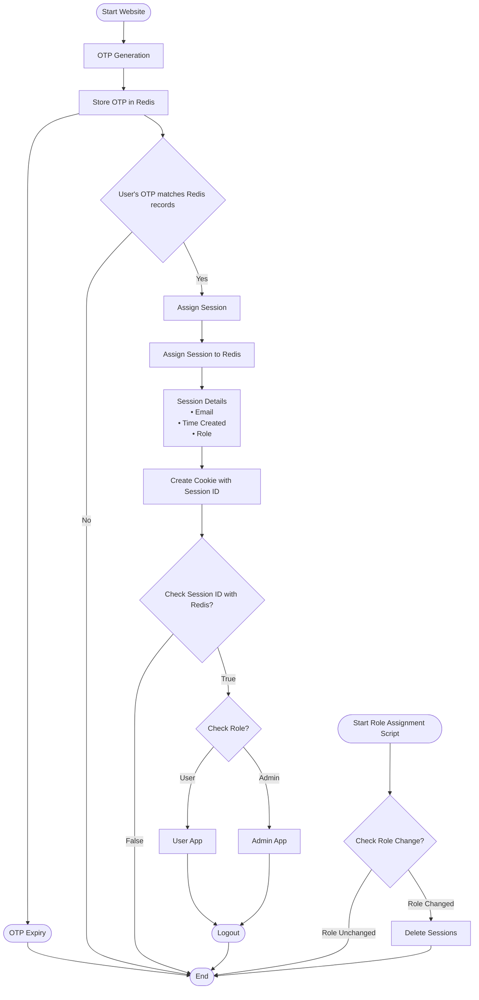

## Authentication Flow

This flow contains 2 apps:
- The main website
- A CLI tool used by developers to assign users to admin roles

The flow contains logic for a session-based authentication and a role based authentication system with a user and admin role. 

