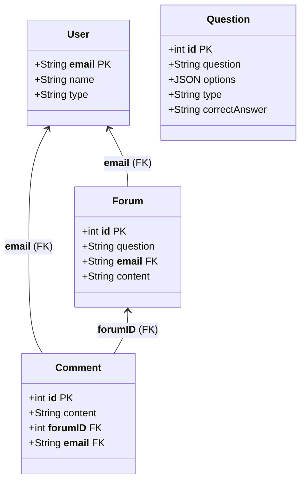

# Database Diagram

```mermaid 
classDiagram
    class User {
        +String **email** PK
        +String name
        +String type
    }

    class Forum {
        
        +int **id** PK
        +String question
        +String **email** FK
        +String content
        
    }

    class Comment {
        
        +int **id** PK
        +String content
        +int **forumID** FK
        +String **email** FK
        
    }

    class Question {
        
        +int **id** PK
        +String question
        +JSON options
        +String type
        +String correctAnswer
        
    }

    %% Relationships based on foreign keys
    User <-- Forum : **email** (FK)

    User <-- Comment : **email** (FK)

    Forum <-- Comment : **forumID** (FK)


```
