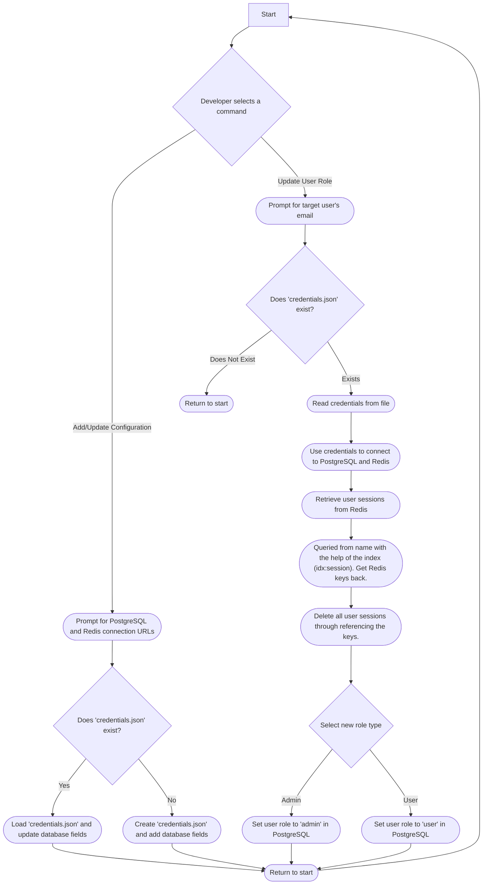

## 🎮 RACT (Role Assignment CLI Tool):

All commands run in infinite loops so they will always return to the start of the program. To stop it, you must press Ctrl+C like any other CLI-based tool.

```mermaid
flowchart 
    Start["Start"] --> CommandChoice{"Developer selects a command"}
    
    CommandChoice -- Add/Update Configuration --> RequestDBCredentials(["Prompt for PostgreSQL and Redis connection URLs"])
    RequestDBCredentials --> CheckConfigFile{"Does 'credentials.json' exist?"}
    CheckConfigFile -- Yes --> LoadAndUpdateConfig(["Load 'credentials.json' and update database fields"])
    CheckConfigFile -- No --> CreateConfigFile(["Create 'credentials.json' and add database fields"])
    LoadAndUpdateConfig --> ReturnToStart(["Return to start"])
    CreateConfigFile --> ReturnToStart

    CommandChoice -- Update User Role --> RequestUserEmail(["Prompt for target user's email"])
    RequestUserEmail --> CheckCredentialsFile{"Does 'credentials.json' exist?"}
    CheckCredentialsFile -- Exists --> ReadCredentials(["Read credentials from file"])
    CheckCredentialsFile -- Does Not Exist --> ReturnToStart2(["Return to start"])
    ReadCredentials --> ConnectToDB(["Use credentials to connect to PostgreSQL and Redis"])
    ConnectToDB --> RetrieveUserData(["Retrieve user sessions from Redis"])
    RetrieveUserData --> QueryFromIndex(["Queried from name with the help of the index (idx:session). Get Redis keys back."])
    QueryFromIndex --> DeleteUserSessions(["Delete all user sessions through referencing the keys."])

    DeleteUserSessions --> PromptForRoleChange{"Select new role type"}
    PromptForRoleChange -- Admin --> UpdateToAdmin(["Set user role to 'admin' in PostgreSQL"])
    PromptForRoleChange -- User --> UpdateToUser(["Set user role to 'user' in PostgreSQL"])
    UpdateToAdmin --> ReturnToStart
    UpdateToUser --> ReturnToStart
    ReturnToStart --> Start
```
