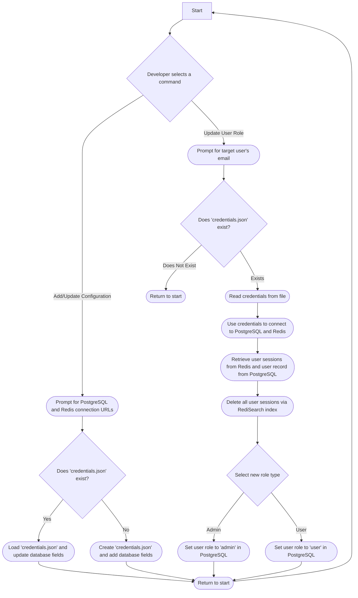

## 🎮 RACT (Role Assignment CLI Tool):

All commands run in infinite loops so they will always return to the start of the program. To stop it, you must press Ctrl+C like any other CLI-based tool.

**TO DO: March 31st 2025** Update the redis session querying to include the RediSearch and querying w/ name from json field using index already built in CLI

From this query, we get keys which we can use to delete, revoking users authentication status to switch role

Branch out from the Retrieve Redis session to show its process of using the index for querying so we can query w/ name from JSON body

