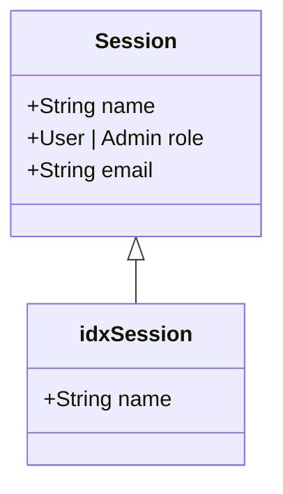

## 🔑 Sessions

The sessions are used to keep track of user information and authentication status in an application. They are stored in a database which in our case is Redis. We use Redis Hashes and RediSearch modules on top of the basic Redis technology.

### Why Redis?

- Fast speeds due to in-server memory
- Quick retrivals due to their software design
- No memory lost concerns as users can simply log back in if data is lost (server crashes). No critical data at stake

The sessions are stored in the form of a Redis hash so we can target a speific field (email, name, etc), This diagram will explain the structuring of the Redis digram visually and more in-depth:
 
 

The idxSession (idx:session) is an index which allows RediSearch to search for a session keyname through the name field (useful for **RACT CLI TOOL**)
